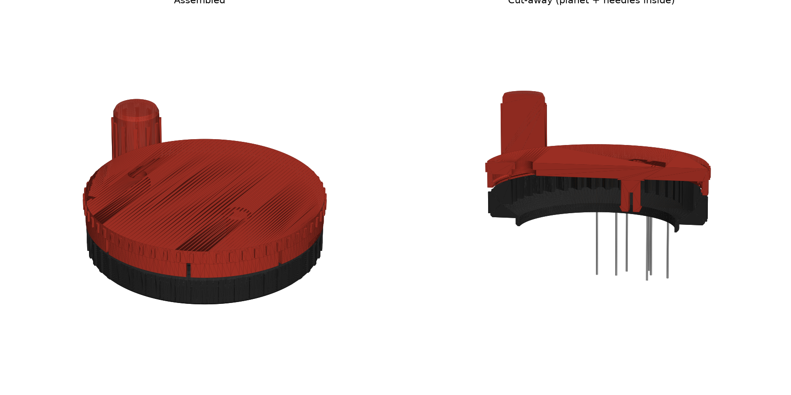
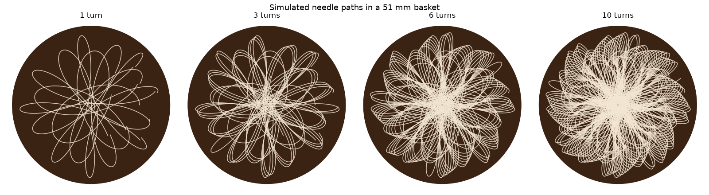

# Spiro51: spirograph WDT tool for the DeLonghi Dedica (51 mm)

A planetary-gear ("spirograph") WDT tool sized for the **DeLonghi Dedica EC685**.
It should also fit the EC680, EC695 and other DeLonghi 51 mm portafilters.
It uses **no bearings, screws or magnets**. The only extra parts are needles
and a drop of glue.




## Files

| File | What |
|---|---|
| `out/spiro51_dedica_wdt.3mf` | All 5 parts on one plate, already in print orientation. Open it in Bambu Studio. |
| `out/spiro51_*.stl` | The same parts as separate STLs |
| `generate.py` | Parametric source. Change the numbers at the top and run it again. |
| `render.py` | Makes the preview images and the needle-pattern simulation |

## Bill of materials

| Qty | Part | Approx. cost |
|---|---|---|
| 12 | Acupuncture needles, **0.25 × 40 mm** (0.30 mm also works) | €2–4 for a pack of 100 |
| 1 drop | Super glue (CA) | already in the drawer |

That's the whole list. The planet axle and the knob are printed snap pins, and the lid snaps onto the base.

## Printing (Bambu P1S, PLA or PETG)

- 0.2 mm layers (0.16 mm gives smoother gears), 3 walls, 15–20 % infill
- **No supports.** Every part is already placed support-free: base and lid print upside down, and the knob prints with its peg up.
- Rough filament use is about 65 g for everything, and about 35 g without the stand.

| Part | Size | Notes |
|---|---|---|
| base | Ø68 × 16 mm | holds the ring gear and the 50.4 mm spigot that drops into the basket |
| planet | Ø37 × 8 mm | holds the 12 needles |
| carrier (lid) | Ø69 × 14 mm | has the snap pin for the planet and the hole for the knob |
| knob | Ø16 × 25 mm | free-spinning crank handle |
| stand | Ø68 × 29 mm | storage cup that protects the needles (optional) |

## Assembly

1. **Test the spigot.** The ring on the bottom of the base should drop into your basket with a little play. If it's too tight or too loose, change `SPIGOT_OD` and regenerate. Don't scale the model, because scaling also changes the gears.
2. **Open the needle holes.** The 0.7 mm holes print at about 0.5 mm. Push a spare needle through each one, or use a needle heated with a lighter.
3. **Fit the needles.** Snip the handles off the acupuncture needles. Push each one **point first** in from the top of the planet (the side with the countersinks and a small dimple) until the cut end sits flush in its countersink.
4. **Snap the planet onto the pin** under the lid, with the dimple side facing the lid.
5. **Set the needle depth.** Lower the lid and planet into the base so the teeth mesh, then press the lid down until it clicks. Put the tool on an **empty** basket and push each needle down until it touches the bottom, then pull it back about 1 mm. Add a drop of CA glue in each countersink.
6. **Fit the knob.** Push the knob into the hole in the lid until it clicks. It should spin freely.

## Use

Put the tool on the dosed portafilter. Hold the base, then turn the knob **6–10 turns** in either direction. The 37-tooth ring and 23-tooth planet share no common factor, so the pattern only repeats every 23 turns. Every extra turn cuts new paths, as the simulation shows. Lift the tool straight up and tamp.

## How it works

- The **ring gear** (37 teeth, module 1.5) is fixed in the base.
- The **planet** (23 teeth) is bigger than half the ring, so its needles sweep every radius from the centre of the puck to about 23.5 mm (the basket wall is at 25.5 mm).
- The needles sit at offsets of 5.1–13 mm from the planet centre, spaced more densely toward the outside. The outer ring of the puck is the largest area and the most prone to channeling.
- The generator checks the gear mesh over a full cycle and the whole assembly for collisions. Both come out at zero overlap, with about 0.15 mm of flank clearance.

## Tweaking

The tuning parameters are at the top of `generate.py`:

- `SPIGOT_OD`: fit in the basket
- `BACKLASH`: raise it if the gears feel tight, lower it if they rattle
- `NEEDLE_HOLE`: needle hole size
- `SNAP_BEAD`: how firmly the lid clicks onto the base

```bash
pip install numpy manifold3d trimesh pillow matplotlib
python3 generate.py   # STL + 3MF into out/
python3 render.py     # preview PNGs
```
