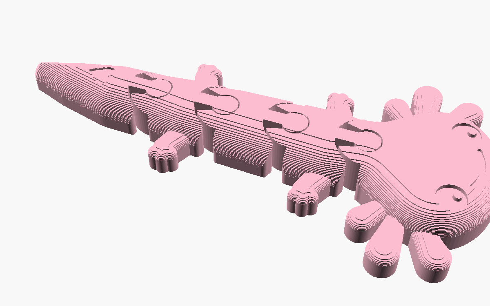
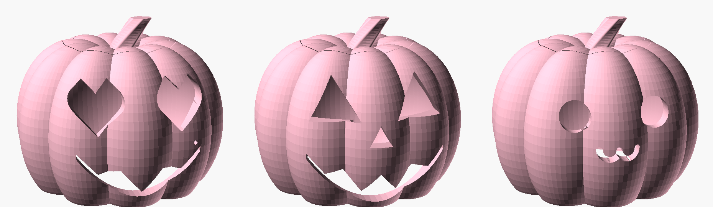
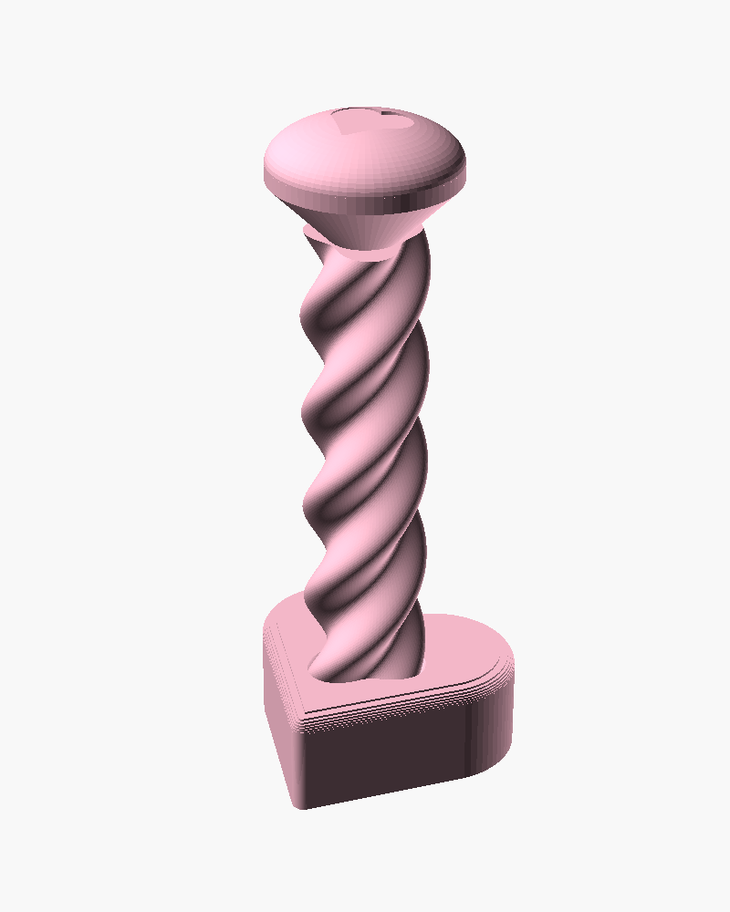

# MakerWorld Pink Farm

Three original, parametric OpenSCAD designs built for one goal: farming
MakerWorld points with **one colour of filament (Bambu milky pink PLA)** on an
**A1 mini (180 × 180 × 180 mm)**. Each one targets something that's trending on
MakerWorld right now (fall 2026). Each one is single-colour by design, so it
looks finished in pink with no AMS. Each one prints without supports.

| Design | Trend it rides | Parts | Plate size | Approx. filament* |
|---|---|---|---|---|
| [Flexi Axolotl](#1-flexi-axolotl) | Articulated "flexi" animals, fidgets | 1 print-in-place | 137 × 65 × 12 mm | ~30 g |
| [Pastel Pumpkin](#2-pastel-pumpkin-lantern--candy-jar) | Halloween (post it **now**) | pumpkin + lid | 120 × 122 × 59 mm | ~80 g |
| [Heart Drop Fidget](#3-heart-drop-spiral-fidget) | Fidget toys, satisfying clips | 1 print-in-place | 36 × 34 × 89 mm | ~20 g |

\*Rough estimate from the mesh volume with 2 walls and 15% infill. Your slicer's number wins.

`.stl` files are pre-rendered with the default settings. Open the `.scad`
files in [OpenSCAD](https://openscad.org) (or upload them to MakerWorld's
Parametric Model Maker) to change anything.

---

## 1. Flexi Axolotl



Pink is the axolotl's natural colour, so single-colour milky pink isn't a
compromise here, it's the look. It has chibi proportions: a big round head,
fanned gills, sparkly eyes, a dopey smile, stubby legs and a plump tail with an
engraved heart (or a name).

**How it works.** The animal is modelled as one smooth domed body, then sliced
into head, 3 body segments and tail. Each joint is a vertical pin with a
45° bulge, sitting in a socket that's a closed ring at the bottom, so it can't
pull out. Every surface is vertical or 45°, so it needs no supports.

**Verified in software:** 5 separate watertight parts, 0.40 mm clearance at
every joint, and every joint swings ±16° with zero collisions (simulated on the
exported mesh).

**Customizer parameters:** `segments` (2–4), `body_height`, `body_dome`
(puffiness), `head_round`, `tail_name` (engraves a name instead of the heart),
`smile`, `clearance`, `max_bend`.

**Print:** 0.2 mm layers, 2 walls, 15% infill, textured PEI, no brim, no
supports. If the joints come out fused, set `clearance` to 0.45–0.5.

## 2. Pastel Pumpkin (lantern / candy jar)



A ribbed pumpkin with a carved lid that carries a curly, twisted stem. Three
styles from one file:

- `lantern`: open bottom, goes over a battery LED tea light. **LED only,
  never a real flame**: PLA softens at around 60 °C.
- `jar`: closed bottom, for candy.
- `solid`: one-piece decoration with the face engraved.

Faces: `hearts` (heart eyes, the pastel-goth look that suits pink), `classic`
(triangle eyes and a toothy grin), `kawaii` (round eyes and a "ω" cat mouth),
or `none`.

**How it avoids supports:** the inside is computed so its ceiling never
overhangs more than 45°. The lid opening is a 45° cone, like a real carved
pumpkin, so the lid sits in it and can't fall in. Every face hole has a
pointed or small round top, so there are no flat bridges.

**Print:** both parts on one plate (see `previews/pumpkin_plate.png`), 0.2 mm
layers, 15% infill. The default 1.8 mm `wall` slices as solid perimeters. Drop
it to 1.2–1.4 for a lighter, faster print that glows more. Use a brim on the
pumpkin if your first layer is fussy (the contact ring is thin).

## 3. Heart Drop spiral fidget



A heart-shaped nut prints already threaded onto a twisted shaft. Flip it and
the heart spins its way down; flip it back and it spins back up. Fidget clips
like this do well in short-video feeds, which is where MakerWorld's
fidget downloads come from.

**Verified in software:** 2 separate parts. The nut was slid along the full
60 mm of travel in simulation, following the helix, with a steady 0.43 mm gap
and no collisions. It stops on the cap at the top and on the foot cone at the
bottom.

**Customizer parameters:** `nut_shape` (heart / round / star; star makes a
Christmas variant), `travel`, `turns`, `lobes`, `cap_heart`, `clearance`.

**Print:** upright, 0.2 mm layers, 3 walls (stronger shaft), 15% infill. If
the nut is stuck after printing, give it a firm twist to break the first
layer free. If it stays stuck, raise `clearance` to 0.55–0.6.

---

## Points plan for the H2D

MakerWorld stopped publishing its exact points formula in mid-2025. What's
public is that points come from your models and **print profiles** being
downloaded, printed and boosted, and that print profiles need to stay at a
4-star rating or better to earn. So the plan is simply: get as many people as
possible to *print* your profiles.

1. **Test-print every design first.** I verified the geometry in software, but
   these haven't been printed yet. A 1-star "joints fused" review hurts more
   than a late upload. Tune `clearance` on your A1 mini, then upload.
2. **Post the pumpkin first.** It's 2 October. Halloween models peak in the
   weeks before the 31st, and a late upload misses most of that.
3. **Make print profiles for several printers, not just the A1 mini.** Most
   MakerWorld users own an A1, P1S, X1C or H2D. Bambu Studio lets you slice for
   printers you don't own, so add one profile per printer family.
4. **Upload the `.scad` to the Parametric Model Maker** (the "Customize"
   button). "Put your name on the axolotl's tail" and "pick your pumpkin face"
   are reasons for people to come back to the page.
5. **Real photos and a short video beat renders.** For example: the axolotl
   wiggling in a hand, the heart dropping, the pumpkin glowing in the dark. The
   cover image decides most clicks.
6. **Keep a cadence.** One strong model rarely gets to 35k on its own. Re-skin
   what works: a Christmas star-nut fidget, a winter axolotl with a scarf,
   then Valentine's hearts in pink. This pink filament suits Valentine's.
7. **Check the points mall.** Compare the H2D's price in the mall with stacking
   gift cards (reported at 490 points for a US $40 gift card), and use
   whichever needs fewer points.

All three designs were made from scratch for you, so they're yours to publish
as originals.

## Files

```
flexi_axolotl.scad / .stl
pumpkin_lantern.scad / .stl      (default: lantern, hearts face, with lid)
heart_drop_fidget.scad / .stl
previews/                        (renders used above + pumpkin plate layout)
```
