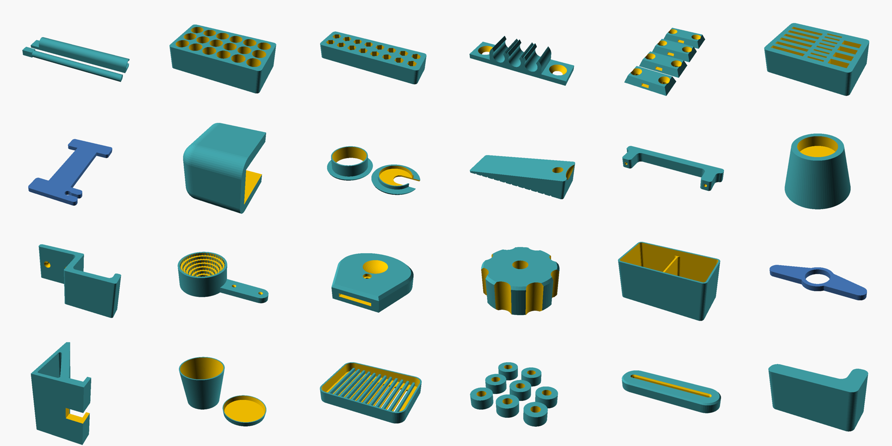

# Everyday OpenSCAD Prints

Twenty-four parametric, genuinely useful things to 3D-print for any home.
Every model is a single self-contained `.scad` file in `models/`, with
ready-to-print default STLs in `stl/` and previews in `png/`.

No supports are needed for any of them, and each file's header says how to
orient it and which material works best.

| Model | What it's for | Key settings |
|---|---|---|
| [`cable_clip`](models/cable_clip.scad) | Snap-in cable holder for under desks, walls, bed frames | cable diameter, number of cables, screw ears |
| [`wall_hook`](models/wall_hook.scad) | Screw-mounted J hook for coats, bags, keys, tools | depth, lip height, screw size |
| [`phone_stand`](models/phone_stand.scad) | Phone/tablet stand with charging-cable slot | device thickness (with case), viewing angle |
| [`organizer_bin`](models/organizer_bin.scad) | Drawer organizer bins that tile on a grid | grid units, height, compartments |
| [`door_wedge`](models/door_wedge.scad) | Door stop with grip grooves and a hang hole | length, height under door |
| [`bag_clip`](models/bag_clip.scad) | Slide-on bag clip — no spring or hinge to break | length, bag thickness |
| [`key_turner`](models/key_turner.scad) | Big-grip key handle for arthritis / weak grip | key size, ring-hole position |
| [`knob`](models/knob.scad) | Knob for M3–M8 nuts or bolts (clamps, jigs, furniture) | thread size, nut or thumbscrew mode |
| [`desk_grommet`](models/desk_grommet.scad) | Cable grommet + cap for desk holes | hole diameter |
| [`furniture_riser`](models/furniture_riser.scad) | Bed/sofa/table riser or leg cup | leg shape and size, lift height |
| [`tube_squeezer`](models/tube_squeezer.scad) | Gets the last bit out of toothpaste and other tubes | tube width |
| [`battery_organizer`](models/battery_organizer.scad) | Tray for AAA/AA/C/D/18650/9V, optional wall keyholes | battery type, rows × columns |
| [`headphone_hook`](models/headphone_hook.scad) | Under-desk headphone hanger, screws reachable from below | drop, arm length |
| [`cord_winder`](models/cord_winder.scad) | Tangle-free wrap for earbuds and cables, with plug slit | length, width |
| [`drawer_pull`](models/drawer_pull.scad) | Replacement drawer/cabinet handle | hole spacing (64/96/128…), standoff |
| [`cable_tie_mount`](models/cable_tie_mount.scad) | Screw-down zip-tie anchors | tie size, count |
| [`card_holder`](models/card_holder.scad) | Stand for SD cards, microSD cards and USB sticks | how many of each |
| [`plant_pot`](models/plant_pot.scad) | Tapered pot with drainage, feet and drip saucer | size, taper, round/square/hex |
| [`soap_dish`](models/soap_dish.scad) | Self-draining soap dish / sponge holder | size |
| [`jar_opener`](models/jar_opener.scad) | Stepped, toothed opener for 30–90 mm lids; can be screwed under a cupboard | size range, handle |
| [`bit_holder`](models/bit_holder.scad) | Screwdriver-bit grid or labelled Allen-key stand | mode, rows/cols, key sizes |
| [`corner_protector`](models/corner_protector.scad) | Soft child-safety cap for sharp table corners (TPU) | table thickness |
| [`spacer`](models/spacer.scad) | Washers, spacers and standoffs in any size | hole, outer diameter, height |
| [`page_holder`](models/page_holder.scad) | Thumb ring that holds a book open one-handed | thumb size, span |



Previews are in alphabetical order, left to right and top to bottom.

## Using them

**Just print it:** grab the STL from `stl/` — the defaults suit the most
common case (e.g. AA batteries, M6 knob, 60 mm desk hole, 6 mm cables).

**Customise it (recommended):**

1. Install [OpenSCAD](https://openscad.org/downloads.html) (free).
2. Open a file from `models/`.
3. Open **Window → Customizer** — every setting appears as a slider or
   dropdown with a description. Change what you need.
4. Press **F6** (render), then **F7** (export STL), and slice as usual.

**Command line:**

```sh
# one-off with custom settings
openscad -o knob_m8.stl -D size=8 -D knob_d=45 models/knob.scad
openscad -o aaa_tray.stl -D 'battery="AAA"' -D cols=8 models/battery_organizer.scad

# re-render all defaults into stl/ and png/
./render_all.sh
```

## Tips that apply to everything

- **Measure, then add clearance.** Settings that say "add ~0.3–1 mm" mean it:
  printers vary, and a part that's 0.5 mm too tight is useless.
- **Strength comes from walls, not infill.** For hooks, risers and knobs use
  4+ perimeters. 15–20 % infill is plenty for everything else.
- **PLA** is fine indoors. Use **PETG** for anything that flexes (cable clip,
  bag clip), carries load (wall hook), or sits in a warm car / near a window.
- **Key turner:** you need one M3 bolt (~16 mm) and an M3 nut. Measure where
  the key's ring hole is (`hole_from_top`) so the bolt goes through it.
- **Knob:** in `nut` mode the nut presses into the bottom; in `bolt` mode a
  hex-head bolt drops in from the top and the thread sticks out the bottom.
- **Bag clip:** fold the bag over the rod (tab end first), then slide the
  channel on from the rod's *free* end.
- **TPU** (flexible) is the best choice for the corner protector, and it also
  makes the jar opener grip better.
- **Drawer pull:** M4 machine screws self-tap into the default 3.4 mm holes;
  for frequent use, set `hole_d` to fit M4 heat-set inserts instead.
- **Furniture riser:** prints upright so the weight squeezes the layers
  together. Use 30 %+ infill for beds and sofas.

All models tested with OpenSCAD 2021.01 and newer.
